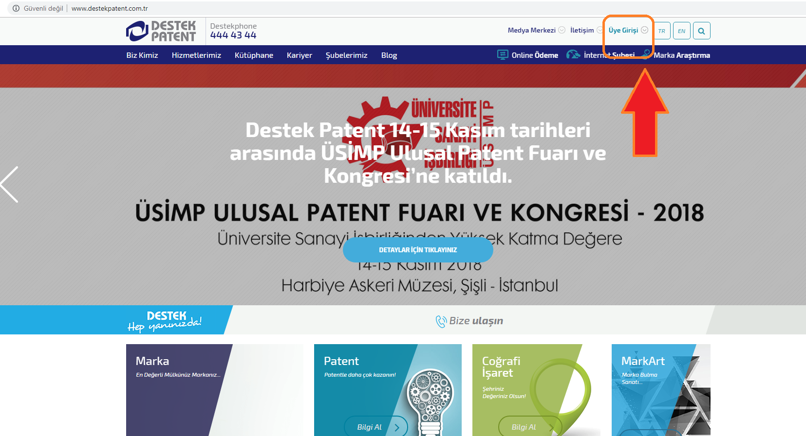
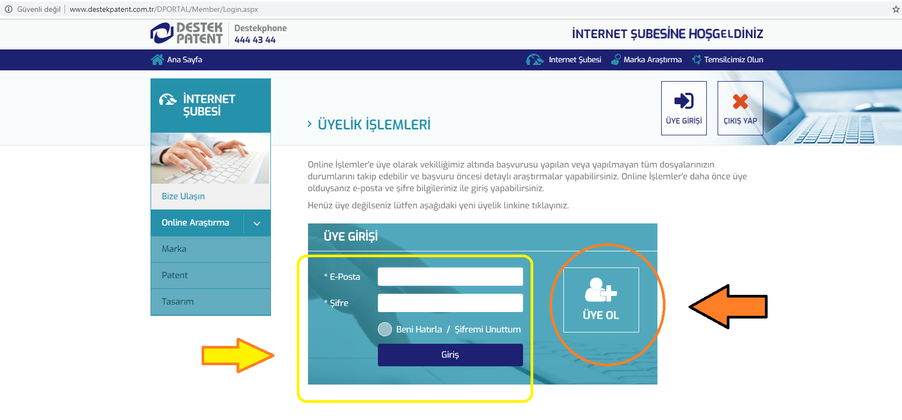
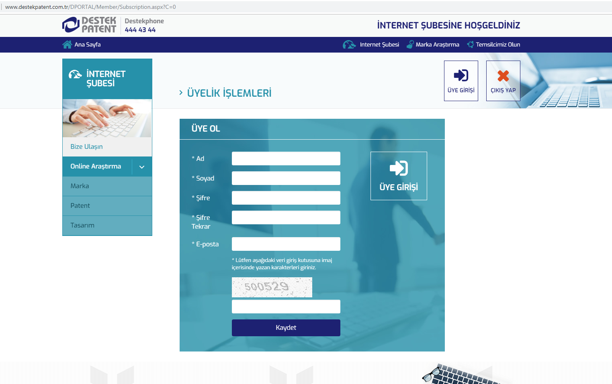
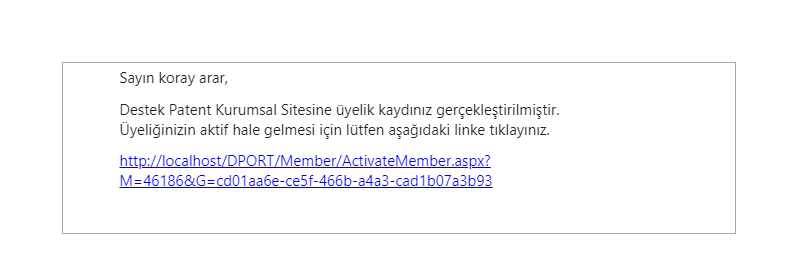
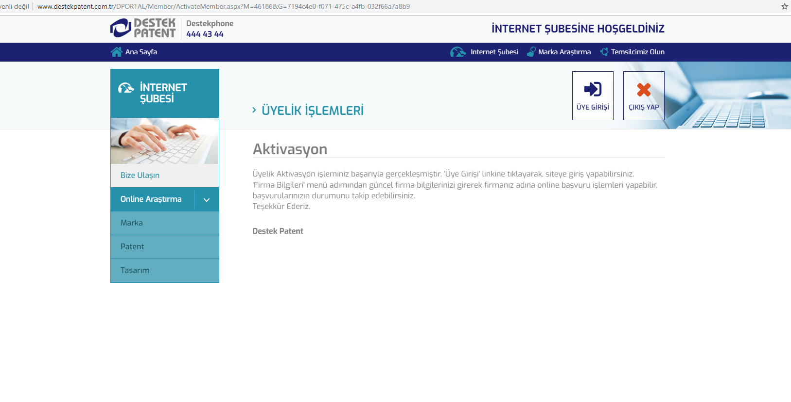
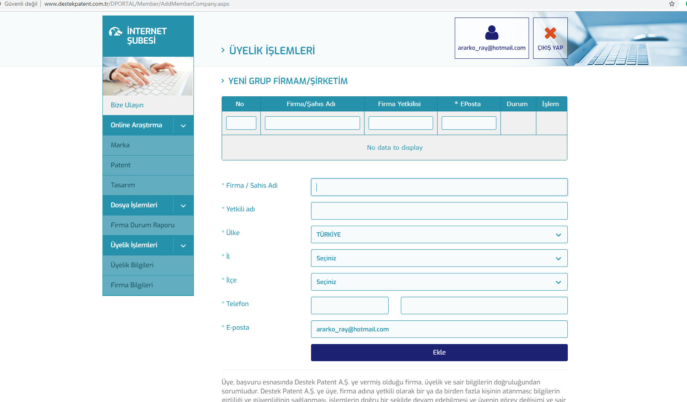

### ÜYELİK İŞLEMLERİ

Destek Patent Online http://www.destekpatent.com.tr/ adresi üzerinden erişebildiğimiz bir platformdur. Sinai haklar kapsamında verdiğimiz hizmetlerimiz, sektörde ki son gelişmeler gibi portal işlevleri dışında müşterilerin firma başvurularıyla ilgili durum raporu alabilecekleri bir uygulamadır.

Özellikle müşterilerimizin dosyalarıyla ilgili takip işlemlerini buradan yapmaları ve ilgili uzman arkadaşları bu anlamda yormamaları adına faydalıdır. Bu duruma istinaden müşterilerimizin bu platformun kullanımı ve özellikle başlangıç aşaması üyelik işlemlerinin tamamlanması anlamında yardımcı olacak adımları hazırladık. Müşteri ile temas halinde olan arkadaşlar için faydalı olacağını umuyoruz.(Not : Anlatılan versiyonu 28.11.2018)

Özet olarak anlatacak olursak sistemimizde ‘Üye’ ve ‘Firmalar’ şeklinde bir ilişki durumu vardır. İlgili firma/firmalar adına başvuruları takip edecek müşteri personeli başlangıç olarak bir üye kaydı oluşturması gerekmektedir. Bu anlamda görev yaptığı şirket çatısı altında kullandığı bir mail adresi ile sisteme üye olup akabinde firmasını tarafımıza sistem üzerinden bildirmesi gerekmektedir. Bizim tarafımıza gelen verinin firma kartı eşleştirilmesi, onayı gibi işlemlerin sonucunda belirtilen firmalar adına rapor alınabilir olacaktır.

Başlangıç olarak sitemizin ana sayfasında sağ üst köşeden ‘Üye Girişi’ tıklanarak üyelik işlemleri için gerekli bilgilerin isteneceği sayfaya yönleneceksiniz.

---

İkinci aşama olarak karşınızda çıkan ekranda daha önceden kayıt olunmuş ise giriş ‘Eposta’ ve ‘Şifre’ alanları ile giriş yapılabilir. Eğer ilk defa sisteme kayıt olunacaksa ‘Üye Ol’ linkine tıklamalıyız.

Karşımıza gelen ekranda üyelik işlemleri için gerekli bilgilerin girişini yapıyoruz ve ‘Kaydet’ e basıyoruz. Mail adresine bir adet aktivasyon maili gelecektir.

---

Gelen mailin içerisinde bulunan linke tıklanılması sonucu üyenin hesabı aktif edilmiş olacaktır. Burada daha önceden belirtildiği üzere kullanıcının kendisine tanımlanan ve çalıştığı iş yerinde kullandığı bir mail adresi olması tercih sebebidir. Mailin kendisine ait olmasının teyidi bu linke tıklaması ile sağlanabilir. Güvenlik amaçlı bu işlemin karşı taraftan yapılmasının talep edilmesi gereklidir.
Bu işlemi yaptıktan sonra kullanıcıyı aşağıdaki ekran karşılayacaktır.

Burada kullanıcı sağ üstte bulunan ‘Üye Girişi’ kısmından daha önce göstermiş olduğumuz Login.aspx sayfasına yönlendirilir, aktivasyon işlemiyle artık sisteme giriş yapabilir.

---

Son adım olarak kullanıcı giriş yaptıktan sonra sol menü kısmında ‘Firma Bilgileri’ bağlantısı ile aşağıda görebileceğimiz form üzerinden ilişkili firma bilgilerinin girişini yapar.

Girilen firma bilgileri Alfasoft üzerinde Sipariş Köprüsü Giriş ve Düzenleme(6.11.1) kısmından ‘İnternet Şubesi Müşterisi’ sekmesinde Çağrı Merkezi Birimi (Oya Karagöz) yönetimi tarafından onaylanmaktadır.

Anlatılan bütün işlemlerin yapılması sonucu müşteri bağlı olduğu firma başvuruları ile ilgili raporu  ‘Firma Durum Raporu’ kısmından alabilir halde olacaktır.

